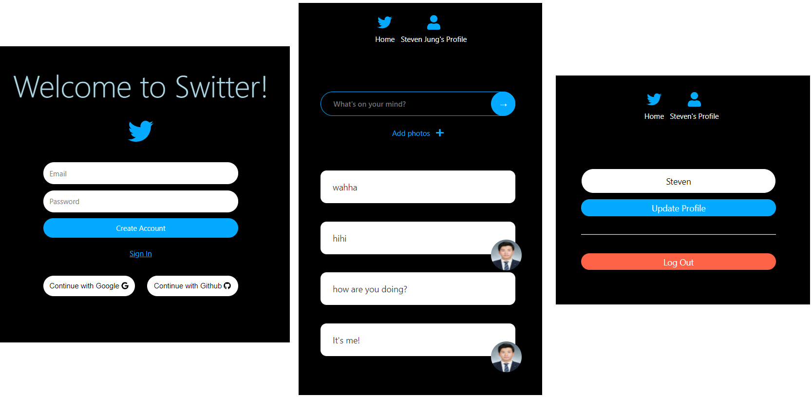

# Twitter Clone Coding

> React JS + Firebase
>
> https://junghyukjin.github.io/switter <<< CLICK!!

----

> **2020.11.4 ~ 11.26**

> **Stack**: HTML, CSS, React JS, Responsive web app
>
> **Tools :** Visual Studio Code, Firebase(APIs, storage, authentification etc...)

---

- 주요기능: 
  1. 이메일 로그인, 구글 로그인, 깃헙 로그인.
  2. Firebase의 API를 사용하여 접속한 사람과 실시간 채팅이 가능, 사진첨부 및 글 삭제 가능.
  3. 자신의 프로필명 변경 가능, 로그아웃 구현.



---

---

#### Firebase?

> firebase는 원래 데이터베이스였고, 구글에 속해있지 않았지만, 구글에 인수가 된 후, 확장되기 시작했다.
>
> 지금은, 훌륭한 백엔드 기능들을 포괄하고 그 기능들을 제공해준다.
>
> mobile, app, web에 사용 가능하다.

> Firebase의 경쟁상대로는 AWS의 Amplify가 있다.
>
> Amplify는 Firebase와 비슷하지만, GraphQL API와 REST API 기능도 제공한다.
>
> Firebase의 역사가 더 길고, 관련 내용이나 사용 방법들이 훨씬 많기 때문에, 이 프로젝트에서는 firebase를 사용할 것이다.

> Firebase는 authentication이 빨라 시간을 투자할 필요가 없이 데이터베이스를 만들 수 있고, 파일 토한 손쉽게 업로드 할 수 있다. 아이디어나 해보고 싶은 개발을 테스트 할 때 사용하기에 아주 적합하다.
>
> 비지니스를 구상중이라면 사용해도 좋지만, 실제 비지니스를 런칭 할 때는 사용하지 않는다. (storage, database, server.. 전부 다 빌려 쓰는 것이기 때문)

> Firebase는 시작은 무료지만, 100%가 무료는 아니다. 테스트하기엔 무료로 충분!

---

#### Setup

- 설치

```bash
// using module bundle로 사용하자.
npm install --save firebase
```

```js
// firebase.js 새로운 파일 생성

import firebase from 'firebase/app';

const firebaseConfig = {
	apiKey: process.env.REACT_APP_API_KEY,
	...
	... (firebase사이트 로그인 > 콘솔클릭,이동 > 프로젝트 생성 > firebase SDK추가 )
};

export default firebase.initializeApp(firebaseConfig);
```

- 깃헙 보안을 위해서 firebaseConfig관련 코드를 전부 업로드 하지 않고, 변수를 만들고 .env파일에 추가.

```
// .env 파일생성
REACT_APP_API_KEY=.... 로 
```

- 그리고 .gitignore파일 마지막에 .env파일을 추가해준다.

